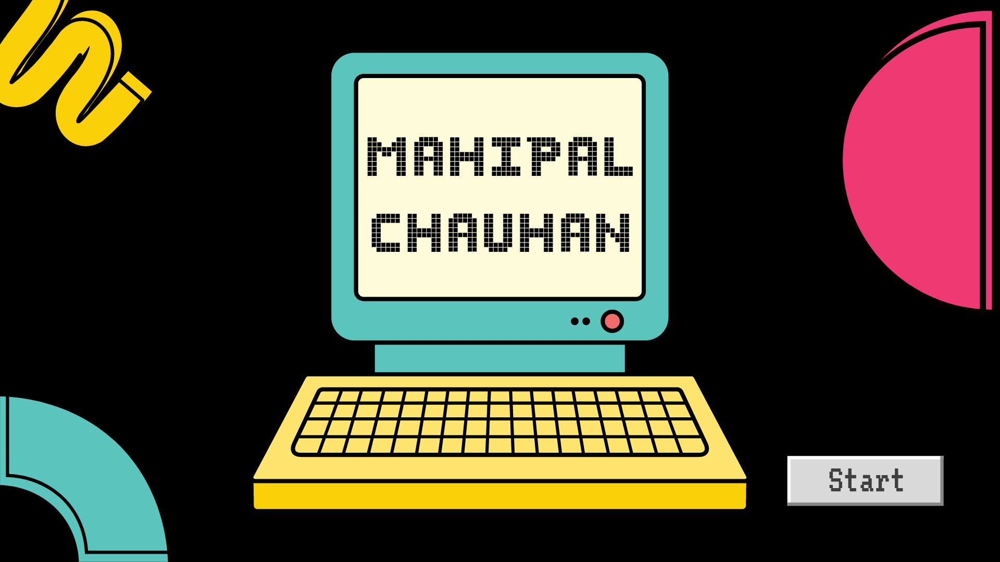

[]

## Hi there! 👋 I'm Mahipal Chauhan, a passionate graphic designer and web developer.

🚀 With a strong foundation in crafting visually appealing designs and developing robust web applications, my journey is all about utilizing diverse technologies to deliver exceptional digital solutions while gaining deep insights into users' needs.
🔐 Industry Authentication standards? Yep, I've got you covered. Incorporating Authorization aspects into the UI framework is just another day at the office for me.

.

 Let's connect and build the future together! 🌟

## 𝗠𝘆 𝗧𝗲𝗰𝗸 𝗦𝘁𝗮𝗰𝗸 :
                   

## 𝗦𝘁𝗮𝘁𝘀

